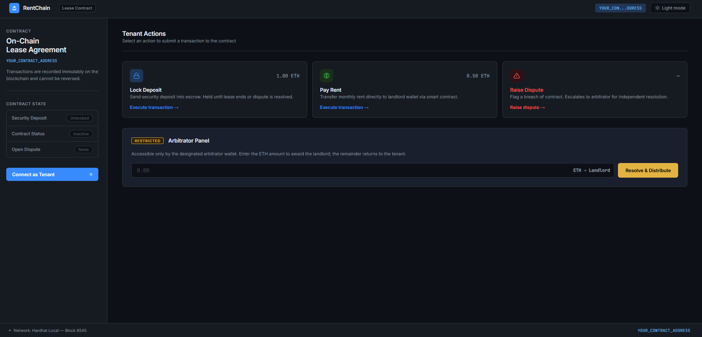

# RentChain

Blockchain-based rental and deposit management system.



## Features

* Smart contract-based rental agreements
* Secure deposit escrow
* Monthly rent payments
* Dispute system with arbitrator
* Real-time contract state

## Tech Stack

* Solidity
* Hardhat 3
* Ethers.js
* React
* JavaScript
* Mocha

## Setup

Install dependencies:

```bash
npm install
```

Run tests:

```bash
npx hardhat test
```

Start local blockchain:

```bash
npx hardhat node
```

Deploy locally:

```bash
npx hardhat run scripts/deploy.js --network localhost
```

Start frontend:

```bash
cd frontend
npm install
npm start
```

Frontend runs at `http://localhost:3000`.

## Configuration

Set the contract address and wallet keys in `frontend/src/App.js`:

```javascript
const CONTRACT_ADDRESS = "YOUR_CONTRACT_ADDRESS";
const TENANT_PRIVATE_KEY = "YOUR_TENANT_PRIVATE_KEY";
const ARBITRATOR_PRIVATE_KEY = "YOUR_ARBITRATOR_PRIVATE_KEY";
```

For Sepolia deployment, use a `SEPOLIA_PRIVATE_KEY` environment variable or Hardhat keystore.

```bash
npx hardhat keystore set SEPOLIA_PRIVATE_KEY
```

